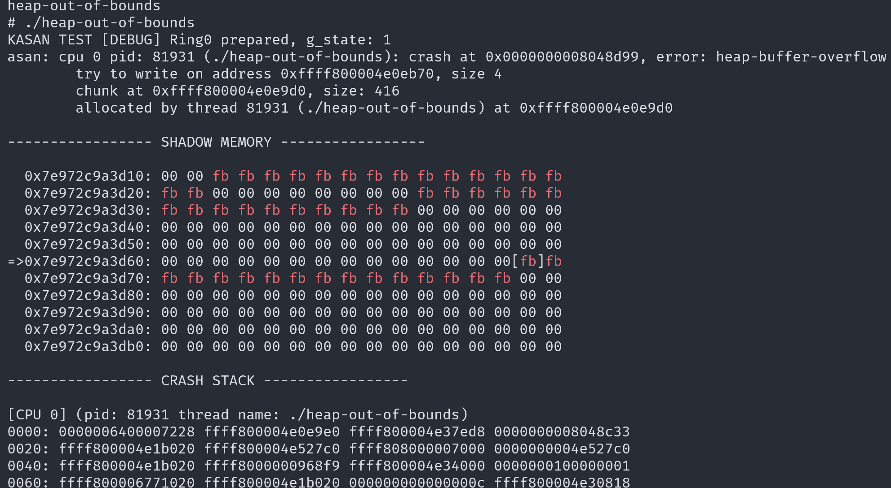

# QNX DEMO

Now we provided a simple qnx demo for catching heap-based memory corruption 
in qnx microkernel.

## Reproducing through Docker Image

For convenience, we prepared a docker image for reproducing the testcases, 
run the following command:

```sh
docker run --rm -i -t elfincanopy/qnx-asan-demo:lastest /bin/bash

# In the docker image shell:
/workspace/run-qemu.sh

# After the qnx shell startup:
cd /mnt/asan-testcases/
# Here we have three testcaeses:
./double-free
./heap-out-of-bounds
./use-after-free
```

Script `/workspace/run-qemu.sh` start qnx 7.0.0 operating system with 
`qemu-kreit-2756b2e562b77b4264c4ef2c927cd1fe8396af78`, which has enabled the 
kernel address sanitizers.

After running these testcases, the qemu will crash and dump error message 
shown in the following pictures:



## Testcases

The testcases is located at [kreit/test/asan-testcaes](../test/asan-testcase/).

To build the testcases binary, you will need to install the qnx toolchain. 
Please refer the qnx official documentation.

After installing the toolchain, run `make` in the `kreit/test/asan-testcaes`, 
the build output is in `kreit/test/asan-testcaes/build`.

The testcases invoke the qnx microkernel's `srealloc()` function by 
`InterruptHookIdle2()` kernel call, which allow user registering a interrupt 
handler in userspace, and calling `srealloc()` function by hardcoded function 
pointer. So the testcase can **only** work on the qnx image provided in the docker image.
